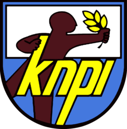

<!DOCTYPE html>
<html lang="id">
<head>
  <meta charset="UTF-8">
  <meta name="viewport" content="width=device-width, initial-scale=1.0">
  KNPI MAUK | Komite Nasional Pemuda Indonesia Mauk
  <link href="https://cdn.jsdelivr.net/npm/tailwindcss@2.2.19/dist/tailwind.min.css" rel="stylesheet">
</head>
<body class="bg-white text-yellow-400">
  <!-- Navbar -->
  <header class="bg-blue-800">
    

      

        
        <h1 class="text-xl font-bold">DPK KNPI MAUK</h1>
      

      <nav class="space-x-4">
        <a href="#beranda" class="hover:text-white">Beranda</a>
        <a href="#tentang" class="hover:text-white">Tentang</a>
        <a href="#kegiatan" class="hover:text-white">Kegiatan</a>
        <a href="#galeri" class="hover:text-white">Galeri</a>
        <a href="#kontak" class="hover:text-white">Kontak</a>
      </nav>
    

  </header>

  <!-- Hero Section -->
  <section id="beranda" class="bg-cover bg-center h-64 flex items-center justify-center" style="background-image: url('https://example.com/banner-knpi.jpg');">
    

      <h2 class="text-3xl font-bold">Selamat Datang di KNPI Kec. Mauk</h2>
      
Bersatu, Bergerak, dan Maju Bersama

    

  </section>

  <!-- Tentang Section -->
  <section id="tentang" class="max-w-4xl mx-auto py-12 px-6">
    <h2 class="text-2xl font-bold text-blue-800 mb-4">Tentang KNPI</h2>
    
Komite Nasional Pemuda Indonesia (KNPI) Kecamatan Mauk adalah wadah pemersatu organisasi kepemudaan di wilayah Kecamatan Mauk, Kabupaten Tangerang. KNPI Mauk hadir sebagai motor penggerak semangat kepemudaan yang aktif, inovatif, dan berdaya saing dalam mendukung pembangunan daerah.

  </section>

  <!-- Kegiatan Section -->
  <section id="kegiatan" class="bg-gray-100 py-12 px-6 text-yellow-400">
    

      <h2 class="text-2xl font-bold text-blue-800 mb-4">Kegiatan Terbaru</h2>
      <ul class="space-y-4">
        <li class="bg-blue p-4 shadow rounded">
          <h3 class="font-semibold text-lg">Lomba Masak dan Senam Bersama</h3>
          
Tanggal: 2 Agustus 2025

          
Lokasi: Lapangan Kantor Kecamatan Mauk

        </li>
        <li class="bg-blue p-4 shadow rounded">
          <h3 class="font-semibold text-lg">Futsal KNPI Cup</h3>
          
Tanggal: 16 Agustus 2025

          
Lokasi: Lapangan Futsal Tanjung Anom

        </li>
        <li class="bg-blue p-4 shadow rounded">
          <h3 class="font-semibold text-lg">Maraton Kemerdekaan</h3>
          
Tanggal: 13 Agustus 2025

        </li>
      </ul>
    

  </section>

  <!-- Galeri Section -->
  <section id="galeri" class="max-w-4xl mx-auto py-12 px-6">
    <h2 class="text-2xl font-bold text-blue-800 mb-4">Galeri Kegiatan</h2>
    

      
      
      
    

  </section>

  <!-- Kontak Section -->
  <footer id="kontak" class="bg-blue-800 py-6 mt-12">
    

      <h3 class="font-bold text-lg">Kontak KNPI</h3>
      
Alamat: Jl. Ir Sutami 4. Mauk

      
Instagram: @dpkknpimauk_official

    

  </footer>
</body>
</html>
